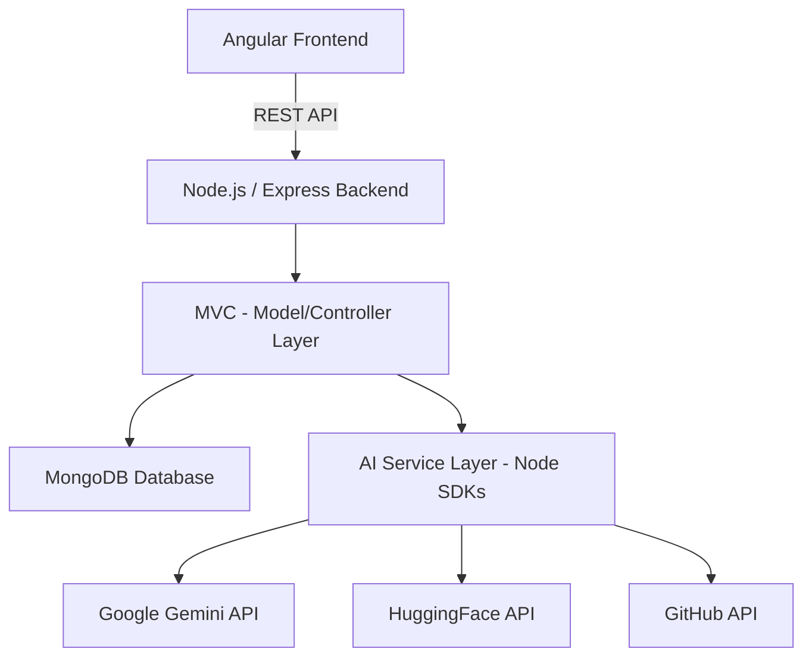

# Product Requirements Document (PRD)
## AI-Powered Developer Job Portal

**Version:** 1.1  
**Date:** February 10, 2026  

---

## Executive Summary

A Node.js-based job portal specifically designed for developer recruitment that leverages AI (via Node.js SDKs) to evaluate coding submissions, detect plagiarism, and provide intelligent candidate ranking. The system follows a strict MVC (Model-View-Controller) architecture for scalability and maintainability.

---

## 1. Product Overview

### 1.1 Vision
To create a fair, intelligent, and automated recruitment platform that accurately assesses developer capabilities through AI-driven code analysis, eliminating bias and providing actionable insights to employers.

### 1.2 Target Users
**Primary Users:**
- Recruiters and hiring managers seeking qualified developers
- Software developers looking for job opportunities

---

## 2. Core Features & Requirements

### 2.1 User Management
- **Developer:** Registration, Profiles, GitHub integration, Resume upload.
- **Employer:** Company registration, Job management, Candidate ranking.

### 2.2 AI-Powered Assessment System
The system integrates AI models directly into the Node.js backend using official SDKs (Gemini, HuggingFace).

**Features:**
- **Challenge Generation:** AI creates coding challenges based on job requirements.
- **Code Analysis:** Evaluates quality, logic, and complexity.
- **Plagiarism Detection:** Uses GitHub API and local patterns.
- **AI-Detection:** Identifies code generated by LLMs.

---

## 3. Technical Architecture

### 3.1 Technology Stack

**Backend:**
- Node.js (Runtime)
- Express.js (Web Framework)
- JavaScript (Language - ES Modules)
- MongoDB / Mongoose (Database & ODM)
- JWT (Authentication)

**Frontend:**
- Angular 16 (Framework)
- Tailwind CSS (Styling)

**Architecture:**
- **MVC Pattern:** Models, Views, and Controllers.
- **Services Layer:** Business logic and AI SDK integrations.

### 3.2 System Architecture

---

## 4. Development Phases (MVC Focus)

### Phase 1: Foundation (Weeks 1)
- Setup Node.js MVC structure.
- Implementation of Authentication and User Models.
- Basic Job CRUD.

### Phase 2: AI & Business Logic (Weeks 2)
- Integration of Google Gemini SDK for challenge generation.
- Implementation of HuggingFace SDK for code quality.
- Developing the Scoring Engine within the Service layer.

### Phase 3: Frontend & Analytics (Weeks 3-4)
- Parallel development of the Angular frontend.
- Employer Dashboard for ranking.
- Advanced reporting and Red Flag alerts.

---

## 5. Non-Functional Requirements
- **Performance:** AI analysis within <30 seconds.
- **Security:** JWT-based protection, HTTPS, data encryption.
- **Scalability:** Horizontal scaling for Node.js instances.

---

**Document Version History:**
- v1.0 - February 9, 2026 - Initial PRD
- v1.1 - February 10, 2026 - Aligned with MVC JavaScript/Node.js stack
